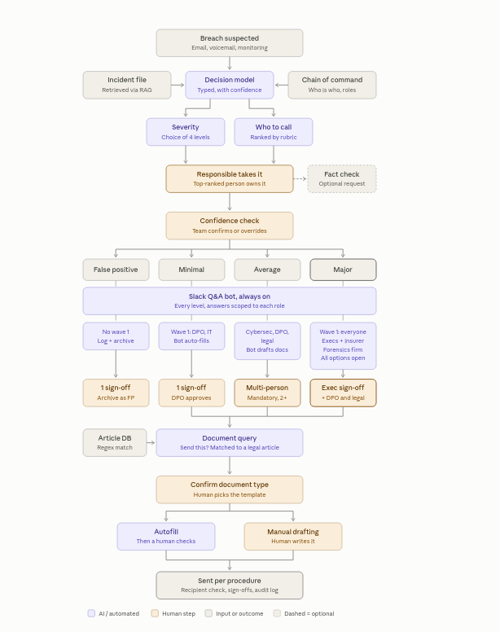

<div align="center">


# Sphynx

**An incident-response copilot for GDPR — inside Slack.**

*Mistral AI Hackathon · 2026*


</div>

---

When a company suspects a data breach, the hardest part isn't the technical clean-up — it's the law. Within 72 hours someone has to figure out whether regulators must be told, whether the people whose data leaked must be warned, and get the paperwork right, all while facts are still coming in and the clock is running. **Sphynx is a copilot that runs that process from the first Slack message**: it starts the clock, asks only the right people the few questions that actually change the legal answer, works out what the law requires, and drafts the notifications — leaving every real decision to a human.

> **The promise:** from the first message, the tool starts the clock, asks the right people only the questions that change the GDPR analysis, and prepares the assessment and the drafts. The lawyer decides, and everything is recorded.



---

## The one idea that makes it trustworthy

**The AI reads and writes text. Written rules decide. A human validates.**

- **Mistral** reads messages (a phishing report, a free-text reply) and turns them into *sourced* facts — every fact it proposes quotes the exact words it came from.
- **The legal rules** (hand-written by the lawyers, versioned) take those facts and compute the obligations. The AI never decides whether to notify a regulator.
- **A person confirms** every fact and signs every decision. Nothing is sent anywhere automatically.

This matters because a wrong "you don't need to notify" is the expensive mistake. So the engine is deliberately cautious: an obligation can be flagged **"required"** on facts that are only *proposed*, but it is only marked **"not required"** once every fact it relies on has been *confirmed* by a human. If two people give conflicting answers, the fact becomes **contested** and counts as unknown until it's reconciled.

---

## How it works, start to finish

Everything happens in Slack; a web dashboard shows the live picture.

1. **Report.** Anyone types `/incident <what happened>` in Slack. Mistral decides it's a real incident, writes a short brief, and proposes a severity and a first set of facts. The 72-hour clock starts from this moment (and can be corrected later without ever "restarting").
2. **Route.** The bot sends a direct message to the right people **by role** — IT, the business owner, the DPO, the lawyer, management — and asks each of them *only* the questions whose answer could change the legal outcome. Nobody sees questions that aren't theirs.
3. **Answer.** People reply with one-click buttons, or just **type a sentence** — Mistral pulls several facts out of one message and offers a one-click confirm. Ask the bot a question too: *"why is the CNIL notification required?"* or *"what if the data had been encrypted?"* — the hypothetical is re-computed by the real rules, never guessed.
4. **Assess.** As facts land, the engine continuously works out the four obligations and their deadlines:
   - **Notify the data protection authority (CNIL)** — GDPR Art. 33, within 72 h.
   - **Inform the people concerned** — GDPR Art. 34, without undue delay, when the risk is high.
   - **Record it in the internal breach register** — GDPR Art. 33(5), always.
   - **Inform the client** — only when the company acted as a processor, not the controller.
5. **Decide.** The DPO recommends; the lawyer signs the decision, with structured reasons.
6. **Draft.** The tool generates the CNIL notification, the register entry, and the notice to the people concerned — as **drafts for a human to review and approve**, never auto-sent.
7. **Trace.** Every step is written to an append-only log that doubles as the breach register: who knew what, when, and why each decision was made.

The dashboard turns this into a crisis-cell view: the incident, a live countdown to the next deadline, who's doing what (and who's blocked), and the full journal.

---

## The demo in one scenario

The reference run is a fictional company, **Nuvola SAS**, hit by a phishing attack: an employee clicks a link, an attacker downloads customer exports from the CRM, ~2,400 B2B contacts are affected, the files were unencrypted. Walking the scripted answers through the tool should land on:

| Obligation | Result |
| --- | --- |
| Notify the CNIL (Art. 33) | **Required** |
| Inform the people concerned (Art. 34) | **Lawyer decides** (no automatic high-risk presumption) |
| Internal register | **Required** |
| Inform a client | **Not required** (Nuvola is the controller) |

The full click-by-click script lives in [`docs/`](docs/). All data in the demo is **fictional** — the app shows a banner saying so, and must only ever be used with synthetic incidents.

---

## Under the hood

| Area | Choice |
| --- | --- |
| App & UI | **Next.js** (App Router) + **React** + Tailwind / shadcn — one app serves both the API routes and the dashboard |
| AI | **Mistral** via the Vercel AI SDK, used only for structured extraction and draft text (never for legal decisions) |
| Rules engine | A pure, versioned GDPR module: `evaluate(facts) → obligations`. No AI, no database, fully unit-tested |
| Data | **Supabase** (Postgres). Writes go through a single transactional `record_event`; `incident_events` is append-only and is the breach register |
| Chat | A **Slack app**: `/incident` slash command, interactive buttons, and the Events API for free-text replies |
| Hosting | **Vercel** |
| Tests | **Vitest** (rules, services) and **Playwright** (end-to-end) |

### Where things live

```
app/            Next.js routes — the dashboard and the /api endpoints (Slack, intake, decide, drafts…)
components/     Dashboard UI and the Slack review controls
lib/
  domain/       The shared contracts (facts, events, obligations) — the vocabulary everything speaks
  regulations/  The GDPR rules, facts catalogue and document templates (the lawyers' work, in code)
  services/     The pipeline: intake, Slack routing, answers, decisions, drafts, notifications
  adapters/     The outside world: Mistral, Supabase, Slack
slack/          The Slack app manifest
supabase/       Database migrations
tests/          Vitest + Playwright
docs/           Demo script, Slack previews, legal decisions
```

### Running it locally

Requires Node 20+ and [pnpm](https://pnpm.io). Copy `.env.example` to `.env` and fill in the keys (Mistral, Supabase, Slack, a demo key), then:

```bash
pnpm install
pnpm dev        # http://localhost:3000  → /dashboard
pnpm test       # unit tests
pnpm build      # production build
```

The Slack features need the app installed in a workspace (see `slack/manifest.yml`); the dashboard and rules run without it.

---

## Who built it

A hackathon team of two developers and three lawyers — the lawyers wrote the decision rules, question wording and document templates; the developers turned them into the engine, the Slack bot and the dashboard. Built for the **Mistral AI** hackathon.

> **Scope & honesty:** this is a prototype for a demo, not a certified compliance product. It uses fictional data only, its access control is demo-grade, and it covers one scenario deeply rather than every regime. The roadmap (real connectors, authentication, more regulations) lives in `TODOS.md`.
